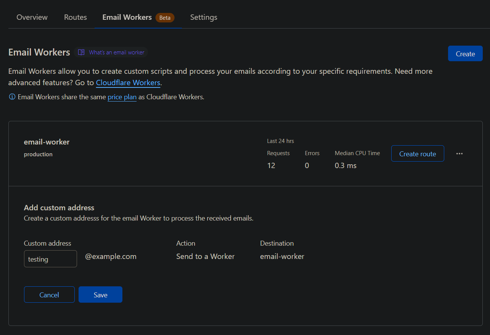

# Email worker &middot; [](https://github.com/webbertakken/email-worker/blob/main/LICENSE) [](https://codecov.io/gh/webbertakken/email-worker) [](https://github.com/webbertakken/email-worker/blob/main/CONTRIBUTING.md)

Send emails to Cloudflare and forward them to different channels using an email worker.

## Setup

#### Prerequisites

- Cloudflare [account](https://dash.cloudflare.com/sign-up) (free)
- [Volta](https://volta.sh/) installed
- Wrangler installed [globally](https://developers.cloudflare.com/workers/wrangler/install-and-update/#install-wrangler-globally)

#### Install dependencies

```bash
yarn install
```

#### Deploy the worker

```bash
yarn deploy
```

#### Set up a webhook

- Right-click on a Discord channel then click `Edit Channel`, then `Integrations`.
- Create a webhook, then copy the URL.
- Add this url to your secrets:

```bash
wrangler secret put DISCORD_WEBHOOK_URL
```

You should see something like this

```console
🌀 Creating the secret for the Worker "email-worker"
✨ Success! Uploaded secret DISCORD_WEBHOOK_URL
```

#### Set up a route

- Go to your [zone's Email Workers settings](https://dash.cloudflare.com/?to=/:account).
- Click the zone (e.g. `example.com`), then `Email`, `Email Routing`.
- On the `Email Workers` tab, register an email route.

[](./assets/email-routing.png)

#### Verify

- Send an email to the email address you registered.
- Check the channel you registered the webhook to.

## Tips

- Change the `name` field in `wrangler.toml` to deploy a separate worker with a separate secret (e.g. with a separate webhook for a test channel). 


## License

This package is [MIT](./LICENSE) licensed.

#### Sub licenses

- [`mat-sz/letterparser`](https://github.com/mat-sz/letterparser): [BSD-3 Clause Clear](https://github.com/mat-sz/letterparser/blob/master/LICENSE)
